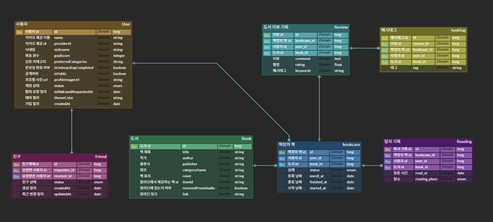

# 📚 Modam Back-End

Modam은 일상의 기록을 통해  
사용자의 독서 습관과 취향을 시각화하고,  
나만의 리듬을 발견하도록 돕는 기록 중심 서비스입니다.

---

### 🔧 Back-End Tech Stack

#### 🖥 Framework & Language

#### 🗄 Data Persistence

#### ☁ Infrastructure & DevOps

 

 

#### 🔌 External Services

#### 🧪 Test

---

### 🗄️ Entity Relational Diagram

###### 정규화를 준수하여 데이터 중복을 최소화하고, 데이터 정합성을 우선으로 설계

---

### ⚙️ Commit Convection

- feat : 새로운 기능 추가  
- fix : 버그 수정
- perf : 성능 개선
- docs : 문서 작업
- refactor 코드 구조 수정
- test : 테스트 코드 관련
- chore : 개발 환경 설정
